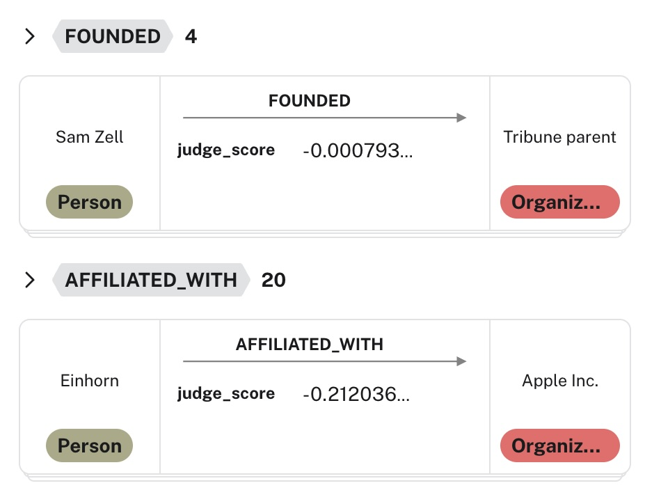

# Clean Knowledge Graphs with a Judge Model


This repository accompanies the presentation [“Clean Knowledge Graphs with a Judge Model”](https://docs.google.com/presentation/d/18vC1CbmhKj3WVNa4z-AZe633xf_VV1sZatxJ0nROEAc/edit?usp=sharing) and provides code and examples for entity–relationship (E-R) extraction, factual validation, and graph cleaning using LLMs and Natural Language Inference (NLI) models.

Producing high-quality knowledge graphs from unstructured text is challenging due to noisy LLM extractions. This repo presents an overall approach and implementation towards addressing this by integrating deterministic judge models for validation within the extraction pipeline. It is a scalable, traceable approach which alleviates hallucination and which can significantly improve the precisions of knowledge graphs built from text, while allowing for high recall.

This approach is also significantly more efficient and less biased than using LLMs alone for both extraction and validation, as a deterministic NLI model can be much smaller, cheaper, and faster to run at scale.

The Judge judges both **entities** (nodes) and **relationships** (edges) extracted by an LLM, scoring them based on whether they are actually supported by the source text, effectively stopping cases where the LLM makes inferences from memory or associations which are not evidenced in the text. This enables building knowledge graphs that are both **complete enough** for insight and **clean enough** for trust.



The models used for NLI judgment can be any of a variety of pretrained models fine-tuned for entailment tasks, such as FLAN-T5, DeBERTa-MNLI, or BART-MNLI. Depending on the model, it will have implicit world knowledge from pretraining on large corpora, but it will only make judgments based on the provided evidence text, not on memorized facts. Fine-tuning on domain-specific data can further improve performance.

### Downstream Uses of a Judged Knowledge Graph

Once judged, the scored knowledge graph can be further processed to **filter out low-confidence facts**, or to ground entities further based on external knowledge bases such as Wikipedia, internal ontologies, etc.

Besides filtering, the scored facts can also be used to **prioritize human review** of uncertain or borderline cases, enabling efficient **human-in-the-loop validation workflows**. They can also be used as **candidates for further fine-tuning** of the judge model itself, or for **weighting facts in downstream reasoning or analytics**.


## Background: The Precision–Recall Trade-off

Achieving **high recall** in Entity–Relationship (E-R) extraction is essential to capture as many entities and relationships as possible. However, this goal is constrained by the **precision–recall trade-off** - pursuing higher recall typically reduces precision, introducing incorrect or spurious facts.

A key challenge in information extraction is to balance **completeness** (recall) and **accuracy** (precision) so that the resulting knowledge graph is both **trustworthy** and **useful**.

| Recall | Precision | Outcome | Description |
|:-------|:-----------|:---------|:-------------|
| **High** | Low | *Noisy & Risky Graph* | Captures many facts but polluted with false entities or relationships - misleading for analytics or AI reasoning. |
| **Low** | High | *Accurate but Incomplete* | Trusted but sparse - safe for compliance or regulated domains, yet limited for discovery and insight generation. |
| **Balanced** | Balanced | *Trusted & Complete Graph* | Captures most relationships while maintaining accuracy; enables reliable downstream analytics and AI agents. |

**Goal:** Build graphs that are both *complete enough* for insight and *clean enough* for trust.

## LLMs vs NLI Models

Large Language Models (LLMs) and Natural Language Inference (NLI) models serve very different purposes in knowledge graph construction.

LLMs are excellent for *discovery* - they can extract a wide range of entities and relationships from text.  
However, they are **generative** and **probabilistic**, meaning their outputs may include hallucinations or inconsistencies.  

NLI models, on the other hand, act as **deterministic validators**, evaluating whether a given extracted claim is actually supported by the source text.

| | **Large Language Models** | **Natural Language Inference (NLI) Models** |
|:-|:-|:-|
| **Type** | Generative and associative | Deterministic entailment classifier |
| **Mechanism** | Predicts the next most likely token to generate entities or relations | Evaluates if a *hypothesis* logically follows from a *premise* |
| **Strengths** | High recall, flexible, context-aware | High precision, factual grounding, reproducible |
| **Weaknesses** | Hallucination, memorization, non-determinism | Lower recall, less generative or exploratory |
| **Ideal Use Case** | Initial E–R extraction and discovery | Validation, scoring, and cleaning extracted facts |

> **Together**, they form a complementary system:  
> the LLM proposes *what might be true*, and the NLI model verifies *what is actually supported by the evidence*.

## Why a Judge Model

Decoder-only LLMs (e.g., GPT, LLaMA) are **not designed to score their own outputs**. They generate text token-by-token, but they don’t produce a single probability representing the truth of a statement. While some APIs expose token-level log probabilities (`logprobs`), these are often unavailable or impractical for hosted models.

To verify whether an extracted entity–relationship (E-R) claim is actually supported by evidence, we introduce a **Judge Model** - a Natural Language Inference (NLI) model that deterministically evaluates *entailment*.

**Example:**

> **Premise:** “Direct Edge spokesman Jim Gorman and BATS spokesman Randy Williams said in an email…”  
> **Hypothesis:** “Direct Edge is an organization.”  
> **Does the premise entail the hypothesis?** → **Neutral**

The NLI model doesn’t hallucinate or rely on prior training associations - it bases its answer **entirely on the given text**.

This approach enables:
- **Deterministic scoring** - each fact gets a reproducible entailment score (logit).  
- **Evidence grounding** - ensures facts are supported by the source text.  
- **Quality control** - filters out unsupported or ambiguous E-R pairs before graph ingestion.  
- **Balance** - complements high-recall LLM extraction with high-precision validation.

> *You can think of the Judge Model as the factual referee for your Knowledge Graph.*

## Models for NLI

Models capable of Natural Language Inference (NLI) are designed to evaluate whether a **hypothesis** logically follows from a **premise**. Unlike decoder-only LLMs, these models provide **deterministic, interpretable scores** (logits) representing *entailment*, *contradiction*, or *neutral* outcomes.

They typically use **encoder–decoder** or **cross-encoder** [transformer](https://www.datacamp.com/tutorial/how-transformers-work) architectures that process both the premise and hypothesis jointly, building a bi-directional representation before producing a prediction.

### Key Characteristics

- **Deterministic entailment model** - evaluates support, contradiction, or uncertainty.  
- **True scoring** - returns logits (not generated probabilities).  
- **Grounded in evidence** - decisions are based only on provided text.  
- **Lightweight and efficient** - smaller models, quantizable, GPU-friendly.  
- **Easily fine-tuned** - often improved with just a few hundred domain examples.  
- **Complements LLMs** - adds factual verification and consistency checking.

### Common Pretrained NLI Models

| Model | Description |
|:--|:--|
| `google/flan-t5-small`, `flan-t5-base`, `flan-t5-large` | Encoder–decoder models fine-tuned for entailment tasks. |
| `microsoft/deberta-v3-large-mnli` | Cross-encoder with strong contextual understanding and precision. |
| `facebook/bart-large-mnli` | Sequence-to-sequence model with robust entailment performance. |
| `google/flan-ul2` | Larger model capable of mixed task generalization. |
| `google/long-t5-tglobal-*` | Extended context models handling >2048 tokens, ideal for long documents. |

All of these are available on [Hugging Face](https://huggingface.co/models) and can be fine-tuned for domain-specific ER validation tasks.

> **Tip:** Pretrained NLI models can reach strong performance with minimal additional data - a few hundred labeled examples are often enough to adapt to your domain.

## Architecture Overview

The LangGraph pipeline we developed here integrates **Large Language Models (LLMs)** and **Natural Language Inference (NLI)** models into a multi-stage pipeline for building clean, grounded Knowledge Graphs.

### Pipeline Stages


1. **Documents → Raw Graph**  
   Entities and relationships are first extracted from text using an LLM.  
   This stage maximizes recall, but may introduce noise, duplicates, or hallucinated facts.

2. **Raw Graph → Judged Graph**  
   Each extracted fact is evaluated by a **Judge Model** (an NLI model such as FLAN-T5 or DeBERTa-MNLI).  
   The model determines whether the fact is *entailed*, *neutral*, or *contradicted* by the evidence and assigns a **truth score**.  
   This creates a scored version of the graph where every node or relationship is annotated with factual confidence.

3. **Judged Graph → Grounded Graph**  
   Entities and relationships that pass validation are **disambiguated and linked** to external sources (e.g., Wikipedia).  
   This produces a **grounded, verifiable Knowledge Graph** ready for analytics, reasoning, or agent use.

### Key Advantages

- **Combines discovery and validation** - LLMs for recall, NLI models for precision.  
- **Evidence-based scoring** - every fact is traceable to its source text.  
- **Lightweight and modular** - works efficiently with quantized models on a single GPU.  
- **Extensible** - can support additional grounding sources beyond Wikipedia.  
- **Trusted output** - produces graphs suitable for downstream AI reasoning and compliance contexts.

## How to use this codebase

The code in this repository is intended to demonstrate the concepts presented in the "Clean Knowledge Graphs with a Judge Model" talk, providing a starting point for building your own knowledge graph extraction and validation pipelines. The main re-usable components are the `t5_judge` and `deberta_judge` modules, which implement the Judge Model functionality using FLAN-T5 and DeBERTa-MNLI, respectively. You can adapt these modules to fit your specific use case, fine-tune them on your domain data, and integrate them into your knowledge graph construction workflows, using the remainder of the code to understand how to integrate them into your own pipeline.

> **Note**: all the judge models require are hypotheses (the extracted entities/relationships) and premise (the source text evidence) pairs, and they will return scores indicating the degree of entailment. However both are required to be in human language - you can't use JSON or Cypher notation. However you can easily wrap any structured data into natural language statements for evaluation - `judge_validator.py` shows how to do this.

Note that `t5_judge` is much more capable even without much fine-tuning, while `deberta_judge` is lighter and faster but will likely require more domain-specific training data to achieve similar performance. The fastest way to understand and experiment with the pipeline, is just to run it end-to-end on the provided sample documents:

```bash
conda env create -f environment.yml
conda activate canonicalizer
python canonicalizer.py
```

Make sure you fill in all necessary variables in `.env` before running the code. Here's an example `.env` file:

```
# ==============================
# LLM configuration
# ==============================
# Choose which LLM backend to use: "openai" or "ollama"
LLM_PROVIDER=openai

# OpenAI (set when LLM_PROVIDER=openai)
# Get a key from https://platform.openai.com/
OPENAI_API_KEY=sk-...your_api_key_here...
# Example model: gpt-4o-mini, gpt-4o, o4-mini, etc.
OPENAI_MODEL=gpt-4o-mini

# Ollama (set when LLM_PROVIDER=ollama)
# Default local server URL: https://github.com/ollama/ollama
OLLAMA_BASE_URL=http://localhost:11434
# Example local model: llama3.1, qwen2.5, mistral, etc.
OLLAMA_MODEL=llama3.1


# ==============================
# Wikipedia grounding / reranker
# ==============================
# Local cache directory for Wikipedia API responses and reranker cache
WIKI_CACHE_DIR=wiki_cache

# Cross-encoder reranker model (used if installed and available)
RERANKERS_MODEL=mixedbread-ai/mxbai-rerank-base-v1

# Wikipedia language and search behavior
WIKI_LANG=en
WIKI_SEARCH_K=50
WIKI_MATCH_THRESHOLD=0.9
# NOTE: Due to code using bool(os.getenv(...)), leave this UNSET to keep False.
# WIKI_USE_DEEPCAT=

# Optional JSON map to bias search queries by label (keep valid JSON)
WIKI_QUERY_HINTS={}

# Labels to attempt Wikipedia grounding for (valid JSON array)
WIKI_GROUND_LABELS=[]


# ==============================
# Judge configuration
# ==============================
# Model used by the JudgeValidator (T5 recommended; can be very large)
KG_JUDGE_MODEL=google/flan-t5-xxl
# annotate: score and keep everything with scores; filter: drop below thresholds
KG_JUDGE_ACTION=annotate
KG_JUDGE_NODE_THRESHOLD=0.5
KG_JUDGE_REL_THRESHOLD=0.5


# ==============================
# Extractor settings (throughput and rate limits)
# ==============================
KG_EXTRACT_BATCH_SIZE=8
KG_EXTRACT_MAX_CONCURRENCY=1
# Requests-per-minute cap (optional; unset to disable)
# KG_EXTRACT_RPM=


# ==============================
# Neo4j connection
# ==============================
NEO4J_URI=neo4j+s://...your_neo4j_instance_here...
NEO4J_USER=neo4j
NEO4J_PASSWORD=...your_password_here...


# ==============================
# Logging
# ==============================
KG_LOG_FILE=out/kg_workflow.log
KG_LOG_LEVEL=DEBUG
KG_LOG_CONSOLE=0
KG_LOG_FORMAT=%(asctime)s %(levelname)s - %(message)s


# ==============================
# Optional: ecosystem tokens (not read directly by code, but commonly needed)
# ==============================
# HUGGINGFACE_HUB_TOKEN=

```

Note this code was developed and tested on Linux with an NVIDIA GPU and CUDA. It should work as is on a Mac with an M1/M2 chip, but performance will be slow, especially if you have <= 32GB of RAM/NVRAM - this is not a reflection of the model or the code. In a properly sized production environment this will be orders of magnitude faster. Once you have run the pipeline, look at the `judge_stats.ipynb` notebook to see relevant stats and visualizations of the judged entities and relationships, and you can explore your judged graph in the configured Neo4j instance.

Computed statistics and visualizations include the distribution of judge scores for entities and relationships, examples of high-and low-confidence facts, allowing you to evaluate the overall performance of both your LLM extraction as well as the Judge Model.


